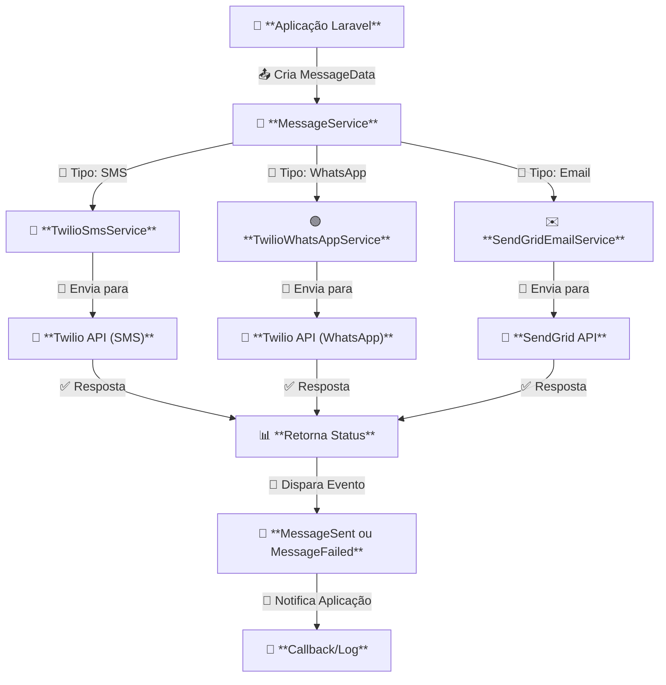

# Componente Messaging para Aplicações Laravel

[](https://packagist.org/packages/inovanti-bank/messaging)
[](https://packagist.org/packages/inovanti-bank/messaging)
[](https://packagist.org/packages/inovanti-bank/messaging)
[](https://packagist.org/packages/inovanti-bank/messaging)

O `inovanti-messaging` é um pacote desenvolvido para facilitar a troca de mensagens e a integração com serviços externos de envio (SMS, e-mail, notificações, etc.) em projetos Laravel 11. O objetivo é fornecer uma API simples para gerenciar provedores de envio, rastreamento de mensagens e logs, sem complicar o fluxo de desenvolvimento.



---

## 📌 Índice

1. [Instalação](#instalação)
2. [Configuração](#configuração)
3. [APIs Suportadas](#apis-suportadas)
4. [Uso](#uso)
   - [Exemplo de Envio de SMS](#exemplo-de-envio-de-sms)
   - [Exemplo de Envio de WhatsApp](#exemplo-de-envio-de-whatsapp)
   - [Exemplo de Envio de E-mail](#exemplo-de-envio-de-e-mail)
5. [Testes](#testes)
6. [Contribuindo](#contribuindo)
7. [Licença](#licença)

---

## 🚀 Instalação

Para instalar este pacote via [Composer](https://getcomposer.org/), utilize o seguinte comando:

```bash
composer require inovanti-bank/messaging

```

## ⚙️ Configuração

### Service Provider

Se você estiver usando o Laravel 11, o próprio framework já pode descobrir automaticamente o provider e a facade.
Porém, caso queira registrar manualmente, adicione no array de `providers` do arquivo `config/app.php`:

```php
'providers' => [
    // ...
    InovantiBank\Messaging\Providers\MessagingServiceProvider::class,
],
```

### Publicar Configurações (opcional)

Este pacote pode conter um arquivo de configuração que você pode publicar para customizar:

```bash
php artisan vendor:publish --provider="InovantiBank\Messaging\Providers\MessagingServiceProvider" --tag="config"
```

Após isso, edite o arquivo `config/messaging.php` conforme necessário.

Adicione as seguintes variáveis no `.env`:

```bash
# Twilio
TWILIO_ACCOUNT_SID=your_account_sid
TWILIO_AUTH_TOKEN=your_auth_token
TWILIO_SMS_FROM=+1234567890
TWILIO_WHATSAPP_FROM=+1234567890

# SendGrid
SENDGRID_API_KEY=your_sendgrid_api_key
SENDGRID_FROM_EMAIL=no-reply@seu-dominio.com
```

## 🌐 APIs Suportadas

Atualmente, a versão `1.0.0` do `inovanti-messaging` suporta as seguintes plataformas de envio de mensagens:

| API          | Tipo de Mensagem | Serviços Disponíveis    |
| ------------ | ---------------- | ----------------------- |
| **Twilio**   | SMS              | `TwilioSmsService`      |
| **Twilio**   | WhatsApp         | `TwilioWhatsAppService` |
| **SendGrid** | E-mail           | `SendGridEmailService`  |

Estamos constantemente adicionando novos provedores de envio ao pacote. Para obter a lista mais atualizada das APIs suportadas e instruções sobre como configurá-las, consulte o [repositório no GitHub](https://github.com/Inovanti-Bank/inovanti-messaging).

Se houver suporte a novos provedores, a documentação será atualizada para incluir instruções específicas sobre como utilizá-los.

## 📩 Uso

Agora o envio de mensagens é feito através de serviços específicos (`TwilioSmsService`, `TwilioWhatsAppService`, `SendGridEmailService`), que são gerenciados pelo MessageService.

### Exemplo de Envio de SMS

```php
use InovantiBank\Messaging\Services\MessageService;
use InovantiBank\Messaging\Services\TwilioSmsService;
use InovantiBank\Messaging\Providers\TwilioProvider;
use InovantiBank\Messaging\DTOs\MessageData;
use Illuminate\Events\Dispatcher;

$twilioProvider = new TwilioProvider(
    env('TWILIO_ACCOUNT_SID'),
    env('TWILIO_AUTH_TOKEN')
);

$smsService = new TwilioSmsService($twilioProvider);

$messageService = new MessageService([
    'sms' => $smsService,
], new Dispatcher());

$messageData = new MessageData(
    type: 'sms',
    to: '+5511987654321',
    from: env('TWILIO_SMS_FROM'),
    content: 'Mensagem SMS de teste via Twilio.'
);

// Enviando mensagem
$response = $messageService->send($messageData);

print_r($response);
```

### Exemplo de Envio de WhatsApp

```php
use InovantiBank\Messaging\Services\MessageService;
use InovantiBank\Messaging\Services\TwilioWhatsAppService;
use InovantiBank\Messaging\Providers\TwilioProvider;
use InovantiBank\Messaging\DTOs\MessageData;
use Illuminate\Events\Dispatcher;

$twilioProvider = new TwilioProvider(
    env('TWILIO_ACCOUNT_SID'),
    env('TWILIO_AUTH_TOKEN')
);

$whatsappService = new TwilioWhatsAppService($twilioProvider);

$messageService = new MessageService([
    'whatsapp' => $whatsappService,
], new Dispatcher());

$messageData = new MessageData(
    type: 'whatsapp',
    to: '+5511987654321',
    from: env('TWILIO_WHATSAPP_FROM'),
    content: 'Mensagem de teste via WhatsApp Twilio.'
);

$response = $messageService->send($messageData);

print_r($response);
```

### Exemplo de Envio de E-mail

```php
use InovantiBank\Messaging\Services\MessageService;
use InovantiBank\Messaging\Services\SendGridEmailService;
use InovantiBank\Messaging\Providers\SendGridProvider;
use InovantiBank\Messaging\DTOs\MessageData;
use Illuminate\Events\Dispatcher;

$sendGridProvider = new SendGridProvider(env('SENDGRID_API_KEY'));

$emailService = new SendGridEmailService($sendGridProvider);

$messageService = new MessageService([
    'email' => $emailService,
], new Dispatcher());

$messageData = new MessageData(
    type: 'email',
    to: 'destinatario@example.com',
    from: env('SENDGRID_FROM_EMAIL'),
    content: 'Este é um e-mail de teste enviado via SendGrid.',
    metadata: ['subject' => 'Teste de E-mail via SendGrid'],
    addCC: ['destinatario2@example.com', 'destinatario3@example.com'],
    addBCC: ['destinatario.oculto@example.com', 'destinatario.oculto1@example.com'],
);

$response = $messageService->send($messageData);

print_r($response);
```

## 🧪 Testes

O pacote vem com testes unitários simulada para garantir que tudo funcione conforme o esperado. Você pode executar os testes usando PHPUnit:

```bash
vendor/bin/phpunit
composer test
```

### Para testes unit:

```bash
vendor/bin/phpunit --testsuite=Unit
composer unit
```

## 🤝 Contribuindo

Contribuições são bem-vindas! Se você deseja reportar um bug, solicitar um novo recurso ou contribuir com código, fique à vontade para abrir uma issue ou enviar um Pull Request.

1. Faça um Fork do projeto
2. Crie sua feature branch: `git checkout -b minha-nova-feature`
3. Commit suas mudanças: `git commit -m 'Adiciona nova feature'`
4. Faça o push para a branch: `git push origin minha-nova-feature`
5. Crie um novo Pull Request

## 📜 Licença

Este projeto está licenciado sob a [MIT license](https://github.com/Inovanti-Bank/inovanti-messaging/tree/production?tab=MIT-1-ov-file).
